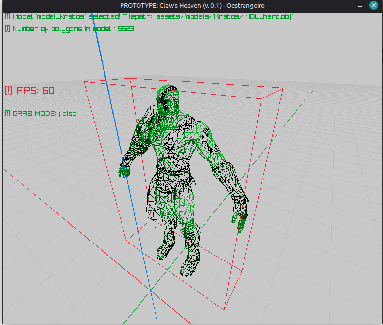

# Claw Finger

Visualizador de modelos 3D desenvolvido em linguagem C e usando a biblioteca [Raylib](https://github.com/raysan5/raylib).

## Requisitos e Dependências

Para compilar e executar o projeto no linux, é necessário instalar as bibliotecas de desenvolvimento do OpenGL, X11 e Wayland:

```bash
sudo apt install libasound2-dev libx11-dev libxrandr-dev libxi-dev libgl1-mesa-dev libglu1-mesa-dev libxcursor-dev libxinerama-dev libwayland-dev libxkbcommon-dev
```

Apos isso, entre no projeto e autorize o script de compilação e execução `'comp.sh'` com

```bash
sudo chmod +x comp.sh
```

Se tudo correu bem até aqui: rode o projeto com
```bash
./comp.sh
```

## Controles:
  - `F1` ativa ou desativa o Wireframe
  - `W,A,S,D` move a câmera
  - `TAB` troca entre a Free Cam e o modo de seleção (Ui Picking)
  - Clique esquerdo seleciona um modelo
  - `G`: Enquanto um modelo estiver selecionado, segure `G` e você poderá deslocá-lo com o ponteiro do mouse
  - Scroll do mouse: Com um modelo selecionado, você pode mudar a escala do modelo
  - `Ctrl` e `barra de espaço`:  Alteram o eixo Y da câmera


Algumas screenshots:




### Notas:
O projeto utiliza o modelo 3D `Lycaste_virginalis-150k.gltf` para fins educacionais e de demonstração, sem fins lucrativos.
O modelo pode ser encontrado nesse [link](https://3d.si.edu/object/3d/lycaste-virginalis-bloom:5ff6e90a-4ddb-4eea-a69c-40970f85fbcb)
